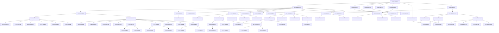

```mermaid
graph TD;
      FYPO:0000903-->FYPO:0004721;
      FYPO:0001350-->FYPO:0000901;
      FYPO:0004650-->FYPO:0005363;
      FYPO:0007848-->FYPO:0007850;
      FYPO:0004510-->FYPO:0007850;
      FYPO:0004614-->FYPO:0005703;
      FYPO:0004614-->FYPO:0006180;
      FYPO:0001350-->FYPO:0005690;
      FYPO:0005693-->FYPO:0005695;
      FYPO:0006335-->FYPO:0006336;
      FYPO:0000054-->FYPO:0001350;
      FYPO:0000737-->FYPO:0007848;
      FYPO:0001350-->FYPO:0000177;
      FYPO:0000119-->FYPO:0000177;
      FYPO:0005694-->FYPO:0006337;
      FYPO:0000054-->FYPO:0007111;
      FYPO:0007745-->FYPO:0007849;
      FYPO:0007848-->FYPO:0007849;
      FYPO:0000901-->FYPO:0004614;
      FYPO:0004614-->FYPO:0005463;
      FYPO:0000903-->FYPO:0004975;
      FYPO:0000177-->FYPO:0001683;
      FYPO:0000737-->FYPO:0004510;
      FYPO:0004614-->FYPO:0006067;
      FYPO:0000177-->FYPO:0007754;
      FYPO:0000177-->FYPO:0004648;
      FYPO:0000054-->FYPO:0007113;
      FYPO:0007113-->FYPO:0007112;
      FYPO:0007111-->FYPO:0007112;
      FYPO:0005692-->FYPO:0007428;
      FYPO:0001350-->FYPO:0005799;
      FYPO:0000902-->FYPO:0006105;
      FYPO:0001350-->FYPO:0005692;
      FYPO:0000902-->FYPO:0003190;
      FYPO:0000902-->FYPO:0007182;
      FYPO:0004621-->FYPO:0004881;
      FYPO:0006336-->FYPO:0006593;
      FYPO:0005690-->FYPO:0004624;
      FYPO:0005693-->FYPO:0004766;
      FYPO:0000234-->FYPO:0004766;
      FYPO:0000902-->FYPO:0004616;
      FYPO:0000902-->FYPO:0003194;
      FYPO:0005692-->FYPO:0006335;
      FYPO:0004766-->FYPO:0005696;
      FYPO:0000901-->FYPO:0000902;
      FYPO:0004621-->FYPO:0006559;
      FYPO:0007745-->FYPO:0007748;
      FYPO:0007745-->FYPO:0007746;
      FYPO:0007113-->FYPO:0007501;
      FYPO:0005692-->FYPO:0000234;
      FYPO:0001350-->FYPO:0004625;
      FYPO:0003194-->FYPO:0004976;
      FYPO:0004614-->FYPO:0004615;
      FYPO:0000119-->FYPO:0000737;
      FYPO:0003304-->FYPO:0005344;
      FYPO:0004621-->FYPO:0004622;
      FYPO:0005693-->FYPO:0005698;
      FYPO:0000054-->FYPO:0004623;
      FYPO:0001350-->FYPO:0006396;
      FYPO:0004620-->FYPO:0004621;
      FYPO:0001350-->FYPO:0004621;
      FYPO:0005692-->FYPO:0007422;
      FYPO:0006335-->FYPO:0005694;
      FYPO:0004614-->FYPO:0005681;
      FYPO:0007484-->FYPO:0007485;
      FYPO:0004510-->FYPO:0007485;
      FYPO:0003194-->FYPO:0004617;
      FYPO:0000902-->FYPO:0004650;
      FYPO:0004650-->FYPO:0005423;
      FYPO:0000902-->FYPO:0007706;
      FYPO:0000902-->FYPO:0005682;
      FYPO:0001350-->FYPO:0000904;
      FYPO:0004727-->FYPO:0004728;
      FYPO:0000902-->FYPO:0000903;
      FYPO:0005692-->FYPO:0005693;
      FYPO:0000054-->FYPO:0004620;
      FYPO:0004727-->FYPO:0004729;
      FYPO:0001350-->FYPO:0004727;
      FYPO:0000054-->FYPO:0007484;
      FYPO:0000737-->FYPO:0007745;
      FYPO:0000177-->FYPO:0003304;
      FYPO:0001350-->FYPO:0003417;
      FYPO:0007745-->FYPO:0007851;
      FYPO:0000054-->FYPO:0000119;
      FYPO:0004766-->FYPO:0005697;
```
